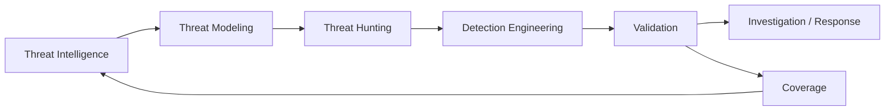

# Architecture

## Objective

Build a traceable defensive engineering pipeline for Azure and Microsoft security telemetry.

## Layers

### 1. Intelligence
Tracks intelligence requirements, behaviors, campaigns, TTPs and intelligence gaps.

### 2. Threat Modeling
Converts threat knowledge into Azure-specific abuse scenarios and attack paths.

### 3. Telemetry
Maps each scenario to Microsoft Sentinel, Defender XDR, Entra and Azure data sources.

### 4. Hunting
Tests hypotheses using KQL and analyst-led investigation.

### 5. Detection Engineering
Promotes stable, repeatable hunting logic into detections with metadata, severity, tuning and response guidance.

### 6. Validation
Checks whether the expected telemetry and signal are actually produced.

### 7. Coverage
Measures what is detectable, partially observable or currently blind.

## Design rule

No detection should exist without a threat rationale and telemetry dependency. No threat model should be considered operational until its observability is understood.
